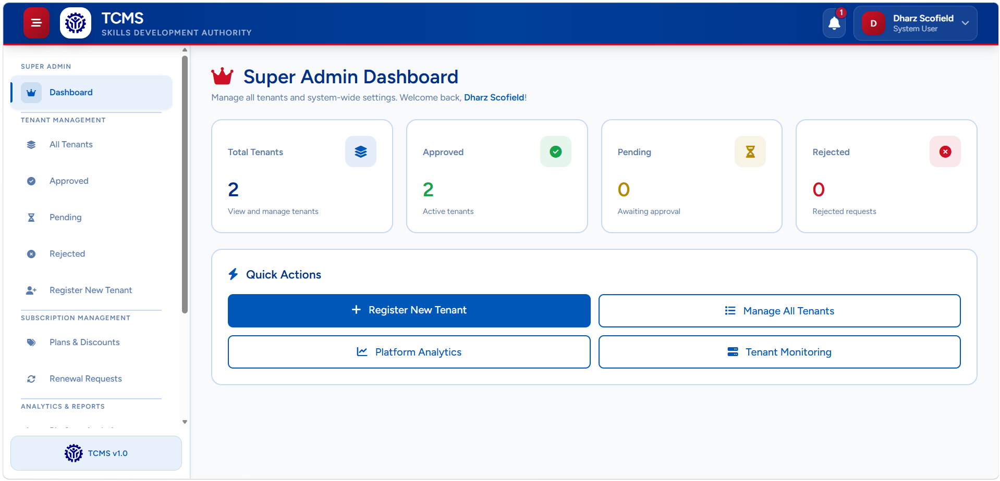
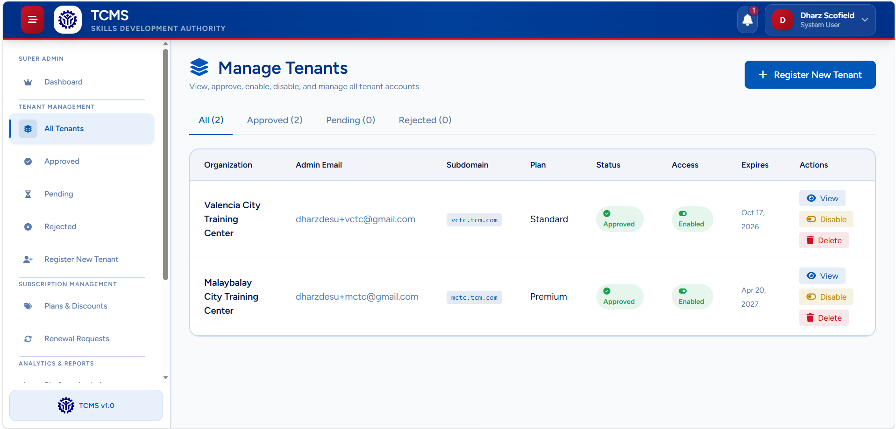
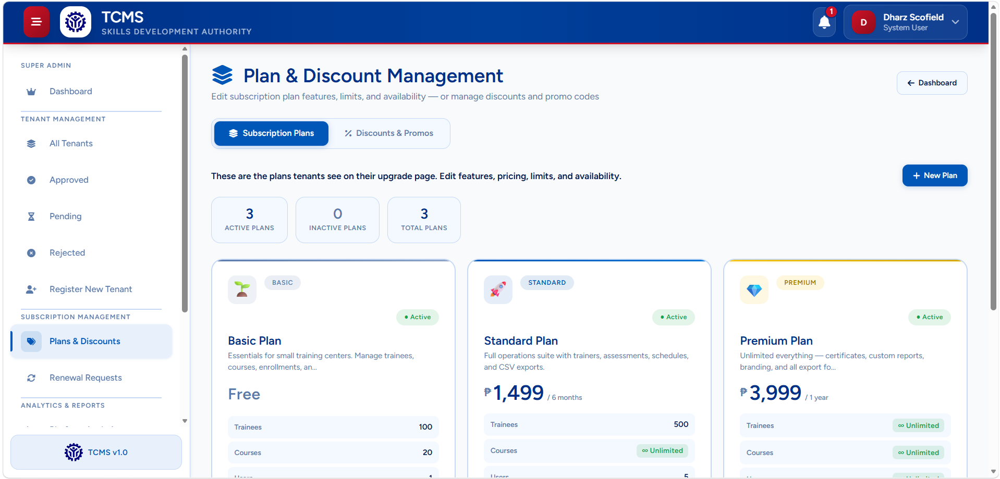
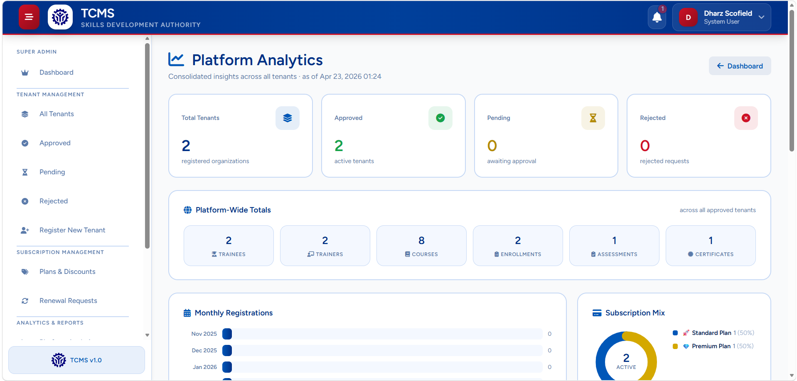
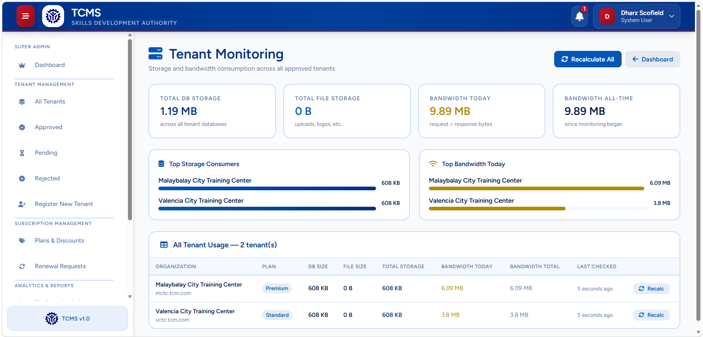

<div align="center">

# TCMS — Training Course Management System

### Multi-Tenant Laravel SaaS for Training, Assessment, and Certification Management

<p align="center">
  
  
  
  
  
  
</p>

<p align="center">
  A comprehensive multi-tenant web application built with Laravel for managing training courses, enrollments, assessments, schedules, certifications, and tenant operations across multiple organizations.
</p>

<p align="center">
  <a href="#overview">Overview</a> •
  <a href="#core-features">Features</a> •
  <a href="#installation">Installation</a> •
  <a href="#configuration">Configuration</a> •
  <a href="#usage">Usage</a> •
  <a href="#deployment">Deployment</a>
</p>

</div>

---

## 📚 Table of Contents

- [🌐 Overview](#overview)
- [✨ Core Features](#core-features)
- [👥 User Roles](#user-roles)
- [🚀 System Highlights](#system-highlights)
- [🛠️ Tech Stack](#tech-stack)
- [🗂️ Project Structure](#project-structure)
- [⚙️ Installation](#installation)
- [🔧 Configuration](#configuration)
- [💻 Usage](#usage)
- [🧪 Testing](#testing)
- [🚢 Deployment](#deployment)
- [🛣️ Roadmap](#roadmap)
- [🤝 Contributing](#contributing)
- [📄 License](#license)
- [📬 Support](#support)

---

## Overview

**TCMS (Training Course Management System)** is a **multi-tenant SaaS platform** built to streamline training and certification processes for multiple organizations using a single Laravel application.

Each tenant operates in an isolated environment and can manage:

- training programs
- courses and schedules
- trainers and trainees
- attendance and assessments
- reports and certifications
- tenant-specific settings and branding

The platform supports **role-based access control** and centralized management through a **SuperAdmin panel**.

---

## Core Features

### 🏢 Multi-Tenancy
- One application with multi-tenant support
- Isolated tenant environments
- Separate tenant domains or subdomains
- Centralized superadmin management
- Tenant-specific branding and customization

### 👥 User Management
- Role-based access control
- Tenant-specific users and permissions
- Organization-level administration
- Secure authentication and authorization

### 📚 Training Management
- Course creation and organization
- Enrollment and registration workflows
- Session and schedule management
- Attendance monitoring
- Trainer assignment and tracking

### 📝 Assessment & Certification
- Quiz and evaluation management
- Performance tracking and grading
- Automated certificate generation
- Downloadable reports and proof of completion

### 📈 Reporting & Operations
- Reports and analytics dashboards
- Subscription and renewal handling
- Email and system notifications
- Activity logging and monitoring
- Export support for PDF and Excel formats

---

## User Roles

| Role | Description |
|------|-------------|
| **SuperAdmin** | Manages tenants, subscriptions, analytics, and system-wide operations |
| **Admin** | Manages organization-specific courses, users, and settings |
| **Trainer** | Conducts training sessions, handles attendance, and manages assessments |
| **Trainee** | Enrolls in courses, views schedules, completes training, and accesses certificates |

---

## System Highlights

- ✅ Multi-tenant architecture using **stancl/tenancy**
- ✅ Laravel-based scalable SaaS setup
- ✅ Tenant-specific access and data isolation
- ✅ Social authentication with **Google OAuth**
- ✅ Real-time notifications
- ✅ PDF certificate generation
- ✅ Excel export support
- ✅ Queue-ready background processing
- ✅ Activity and bandwidth tracking
- ✅ Improved hosting and deployment flexibility

---

## Tech Stack

| Category | Technology |
|----------|------------|
| **Backend** | Laravel 12, PHP 8.2+ |
| **Frontend** | Vite, Tailwind CSS, PostCSS |
| **Database** | MySQL / PostgreSQL |
| **Authentication** | Laravel Sanctum, Laravel Socialite |
| **Multi-Tenancy** | stancl/tenancy |
| **PDF Generation** | DomPDF, FPDF |
| **Spreadsheet Tools** | PhpSpreadsheet |
| **Testing** | Pest PHP |
| **Queues** | Laravel Queues |
| **Caching** | Multiple Laravel cache backends |

---

## Project Structure

```bash
TCMS/
├── app/
├── bootstrap/
├── config/
├── database/
├── public/
├── resources/
├── routes/
├── storage/
├── tests/
└── vendor/
```

---

## Installation

### Prerequisites

Before installing, make sure you have:

- **PHP 8.2+**
- **Composer**
- **Node.js and npm**
- **MySQL or PostgreSQL**

### Setup Steps

#### 1. Clone the repository
```bash
git clone <repository-url>
cd tcm
```

#### 2. Install backend dependencies
```bash
composer install
```

#### 3. Install frontend dependencies
```bash
npm install
```

#### 4. Configure environment
```bash
cp .env.example .env
php artisan key:generate
```

#### 5. Set up the database
```bash
php artisan migrate --force
php artisan db:seed
```

#### 6. Build frontend assets
```bash
npm run build
```

#### 7. Start the application
```bash
php artisan serve
```

---

## Configuration

### Multi-Tenancy Setup

Configure your central domains in `config/tenancy.php`:

```php
'central_domains' => [
    'app.tcm.com',
    // Add your central domain here
],
```

### Social Authentication

Set up Google OAuth in your `.env` file:

```env
GOOGLE_CLIENT_ID=your_client_id
GOOGLE_CLIENT_SECRET=your_client_secret
```

### Database Configuration

Configure your database connection in `.env`:

```env
DB_CONNECTION=mysql
DB_HOST=127.0.0.1
DB_PORT=3306
DB_DATABASE=tcm
DB_USERNAME=your_username
DB_PASSWORD=your_password
```

---

## Usage

### SuperAdmin Access
Use the central domain, such as:

```bash
app.tcm.com
```

SuperAdmin can:
- manage tenants
- monitor subscriptions
- access analytics
- oversee system-wide reports

### Tenant Access
Each tenant uses a dedicated domain or subdomain, such as:

```bash
company.tcm.com
```

Tenant-side users can:
- manage organization-specific courses
- assign trainers and trainees
- schedule sessions
- track attendance and assessments
- access reports and certificates

---

## Testing

Run the test suite with:

```bash
./vendor/bin/pest
```

---

## Deployment

### Production Checklist

- Set the application environment to production
- Configure correct database credentials
- Set up queue workers
- Configure mail settings
- Enable SSL certificates
- Set proper file and storage permissions

### Queue Worker

```bash
php artisan queue:work
```

---

## 📸 Screenshots Gallery

<table>
  <tr>
    <td align="center">
      <a href="./screenshots/dashboard.png">
        
      </a>
      <br />
      <sub><b>Super Admin Dashboard</b></sub>
    </td>
    <td align="center">
      <a href="./screenshots/tenant-management.png">
        
      </a>
      <br />
      <sub><b>Tenant Management</b></sub>
    </td>
  </tr>
  <tr>
    <td align="center">
      <a href="./screenshots/subscription-management.png">
        
      </a>
      <br />
      <sub><b>Subscription Management</b></sub>
    </td>
    <td align="center">
      <a href="./screenshots/analytics-reports.png">
        
      </a>
      <br />
      <sub><b>Analytics & Reports</b></sub>
    </td>
  </tr>
</table>

<p align="center">
  <a href="./screenshots/infrastructure.png">
    
  </a>
  <br />
  <sub><b>Tenant Monitoring</b></sub>
</p>

---

## Roadmap

- [ ] Add more analytics visualizations
- [ ] Improve real-time notification features
- [ ] Enhance tenant customization options
- [ ] Add more advanced reporting tools
- [ ] Optimize deployment workflows
- [ ] Expand role permissions and module flexibility

---

## Contributing

Contributions are welcome.

1. Fork the repository
2. Create a feature branch
3. Commit your changes
4. Run tests
5. Submit a pull request

---

## License

This project is licensed under the **MIT License**.

---

## Support

For support, questions, or bug reports:

- Open an issue in the repository
- Contact the development team
- Submit feature suggestions through your project channel

---

<div align="center">

### 💡 Built to streamline multi-organization training management with scalability, isolation, and efficiency.

</div>
